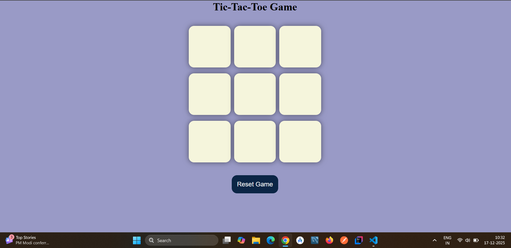

# Tic Tac Toe Game 🎮

A simple and interactive **Tic Tac Toe** game built using **HTML, CSS, and JavaScript**. This project is perfect for beginners who want to understand DOM manipulation, event handling, and basic game logic in JavaScript.

---

## 📌 Project Overview

This is a classic **two-player Tic Tac Toe game** where:

* One player plays with **O**
* The other player plays with **X**

The game automatically:

* Detects a **winner**
* Shows a **draw message** if all boxes are filled
* Allows players to **reset** or **start a new game**

---

## ✨ Features

* Interactive 3×3 game board
* Player turn switching (O ↔ X)
* Winner detection using predefined patterns
* Draw detection after 9 moves
* Reset game functionality
* Clean and responsive UI

---

## 🛠️ Tech Stack

* **HTML5** – Structure of the game
* **CSS3** – Styling and layout
* **JavaScript (ES6)** – Game logic and interactivity

---

## 📂 Project Structure

```
Tic-Tac-Toe/
│
├── index.html      # Main HTML file
├── style.css       # Styling file
├── app.js          # Game logic (JavaScript)
└── README.md       # Project documentation
```

---

## ▶️ How to Run the Project

1. Download or clone this repository
2. Open the project folder
3. Double-click on **index.html**
4. Play the game in your browser 🎉

*No additional setup or dependencies required.*

---

## 🎯 Game Rules

* Players take turns clicking on empty boxes
* First player uses **O**, second player uses **X**
* A player wins if they align three symbols:

  * Horizontally
  * Vertically
  * Diagonally
* If all 9 boxes are filled and no winner is found, the game ends in a **draw**

---

## 📸 Screenshots (Optional)



---

## 🚀 Future Improvements

* Add Player vs Computer (AI)
* Add score tracking
* Improve animations and UI
* Make the game mobile-first

---

## 👨‍💻 Author

**Vinay Singh Rawat**
JavaScript Learner

